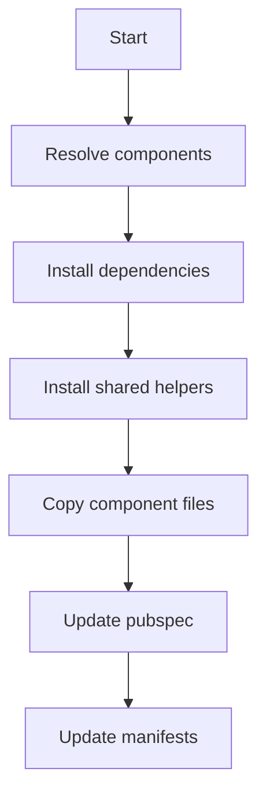

# add

## Purpose
Install one or more components and their dependencies.

## Syntax

```bash
flutter_shadcn add <component> [more...] [options]
```

## Options

- `--all`: install all components

## Behavior Details

- Resolves component dependencies (dependsOn)
- Installs shared helpers referenced by components
- Copies component files into `<installPath>`
- Updates `pubspec.yaml` in batches
- Writes per-component manifests

## Inputs

- Component ids
- Registry metadata

## Outputs

- Component files in `<installPath>`
- Shared files in `<sharedPath>`
- Manifest updates in `<installPath>/components.json` and `.shadcn/components/`

## Flow



## Examples

```bash
flutter_shadcn add button
flutter_shadcn add button dialog
flutter_shadcn add --all
```

## Common Errors

- Component not found: verify registry metadata
- Missing shared item: registry shared section incomplete
