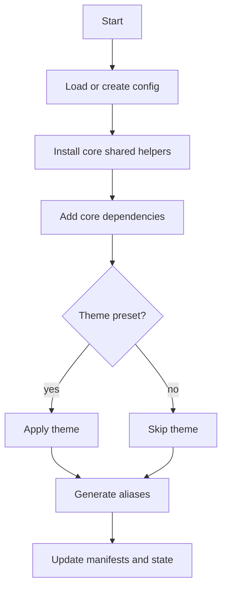

# init

## Purpose
Initialize a Flutter project for shadcn components. This creates config, installs core shared helpers, and can apply a theme.

## Syntax

```bash
flutter_shadcn init [options] [components...]
```

## Options

- `--yes`: use defaults without prompts
- `--install-fonts`: install typography fonts
- `--install-icons`: install icon font assets
- `--install-path`: override install path
- `--shared-path`: override shared path
- `--include-readme`, `--include-meta`, `--include-preview`: optional file toggles
- `--prefix`: class alias prefix
- `--theme`: theme preset id
- `--alias`: path alias mapping

## Behavior Details

- Prompts for install/shared paths unless `--yes` or overrides are supplied
- Installs core shared helpers (theme, util, color_extensions, form_control, form_value_supplier)
- Adds core dependencies (data_widget, gap)
- Applies a theme preset if selected
- Writes install and per-component manifests

## Inputs

- Registry root (local or remote)
- User configuration and flags

## Outputs

- `.shadcn/config.json`
- `.shadcn/state.json`
- `<installPath>/components.json`
- `.shadcn/components/<id>.json` (per-component)
- Shared helper files under `<sharedPath>`

## Flow



## Examples

```bash
flutter_shadcn init
flutter_shadcn init --yes
flutter_shadcn init button dialog
flutter_shadcn init --all
```

## Common Errors

- Registry not found: set `--registry-path` or `--registry-url`
- Schema validation failure: run `doctor` to inspect schema path
