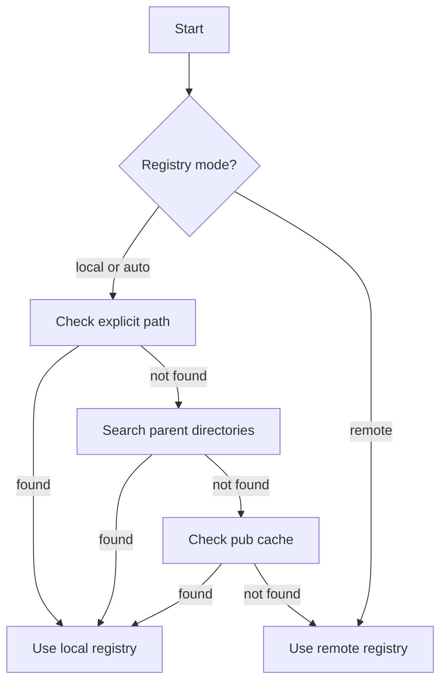

# Registry Resolution

The CLI resolves the registry in the following priority order:

1. `--registry-path` (explicit local path)
2. `.shadcn/config.json` values
3. Local kit registry (parent directories)
4. Pub cache global registry
5. Remote registry base URL

## Flow Diagram

## Remote Registry Structure

The CLI assumes a base URL that contains `/registry/components.json` and `/registry/shared/...`.
