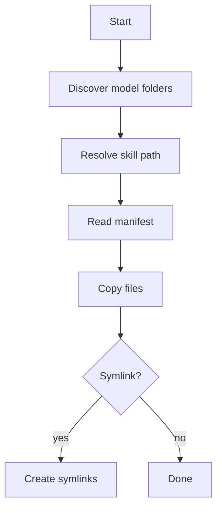

> Legacy v0.1.9 reference documentation.
> For active development, use the v0.2.0 documentation set in this site.

# install-skill

## Purpose
Install AI skills into model folders using skill manifests.

## Syntax

```bash
flutter_shadcn install-skill [--skill <id>] [--model <name>] [options]
```

## Options

- `--skill`: skill id
- `--model`: model folder
- `--list`: list installed skills
- `--available`: list available skills
- `--interactive`: multi-skill install
- `--symlink`: create symlinks

## Flow


