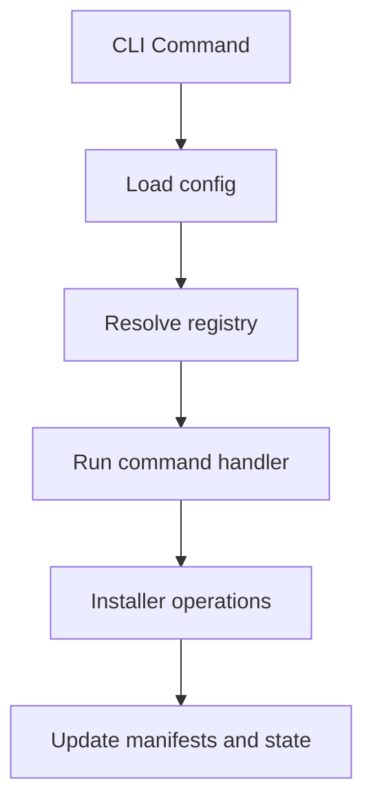

> Legacy v0.1.9 reference documentation.
> For active development, use the v0.2.0 documentation set in this site.

# Architecture

## Modules

- `bin/shadcn.dart`: CLI entrypoint, argument parsing
- `lib/src/installer.dart`: install/remove/sync logic
- `lib/src/registry.dart`: registry loading and schema validation
- `lib/src/config.dart`: .shadcn/config.json
- `lib/src/state.dart`: .shadcn/state.json

## High-Level Flow

