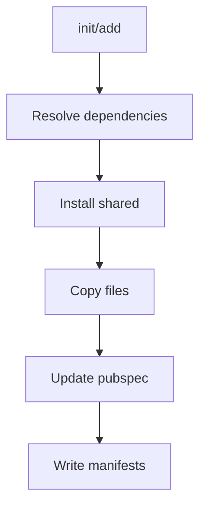

> Legacy v0.1.9 reference documentation.
> For active development, use the v0.2.0 documentation set in this site.

# Install Flow (init/add)

## init

1. Ensure config exists or prompt
2. Install core shared helpers
3. Add core dependencies
4. Apply theme if requested
5. Write manifests

## add

1. Resolve component and dependencies
2. Install shared helpers
3. Copy component files
4. Update pubspec
5. Write manifests

