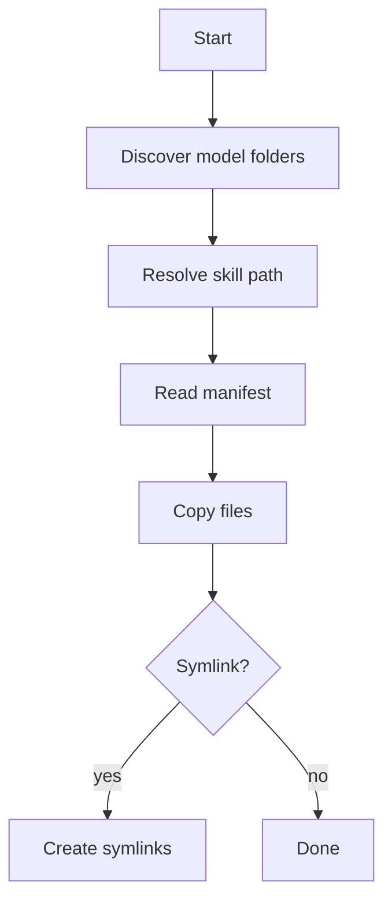

> Legacy v0.1.9 reference documentation.
> For active development, use the v0.2.0 documentation set in this site.

# install-skill Deep Dive

## Workflow

1. Discover model folders in project root
2. Resolve skill source path
3. Read skill.json or skill.yaml
4. Copy allowed files
5. Optional symlink to other models

## Flow Diagram



## Example

```bash
flutter_shadcn install-skill --skill flutter-shadcn-ui --model .claude
```
