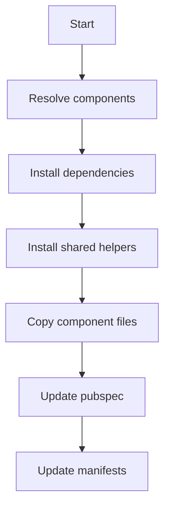

# add

## Purpose
Install one or more components and their dependencies.

## Syntax

```bash
flutter_shadcn add <component> [more...] [options]
flutter_shadcn add @<namespace>/<component> [more...]
flutter_shadcn add <namespace>:<component> [more...]
```

## Options

- `--all`: install all components
- `--include-files`: include optional file kinds (`readme`, `preview`, `meta`)
- `--exclude-files`: exclude optional file kinds (`readme`, `preview`, `meta`)

## Behavior Details

- Resolves component dependencies (dependsOn)
- Supports explicit namespace selection via `@namespace/component` (preferred)
- Supports legacy qualified syntax `namespace:component`
- Unqualified ids resolve by default registry first, then enabled registries
- Fails on ambiguous unqualified ids and asks for namespace-qualified form
- `--include-files` and `--exclude-files` are mutually exclusive
- Optional file policy precedence: CLI flags > per-registry config (`registries.<ns>.includeFiles/excludeFiles`) > legacy booleans (`includeReadme/includePreview/includeMeta`)
- `preview` matching is substring-based, so `preview_state.dart` is also treated as preview
- Installs shared helpers referenced by components
- Copies component files into `<installPath>`
- Updates `pubspec.yaml` in batches
- Writes per-component manifests

## Inputs

- Component ids
- Registry metadata

## Outputs

- Component files in `<installPath>`
- Shared files in `<sharedPath>`
- Manifest updates in `<installPath>/components.json` and `.shadcn/components/`

## Flow



## Examples

```bash
flutter_shadcn add button
flutter_shadcn add button dialog
flutter_shadcn add @shadcn/button
flutter_shadcn add orient:card
flutter_shadcn add @shadcn/button --include-files=preview
flutter_shadcn add @shadcn/button --exclude-files=readme,meta
flutter_shadcn add --all
```

## Common Errors

- Component not found: verify registry metadata
- Missing shared item: registry shared section incomplete
