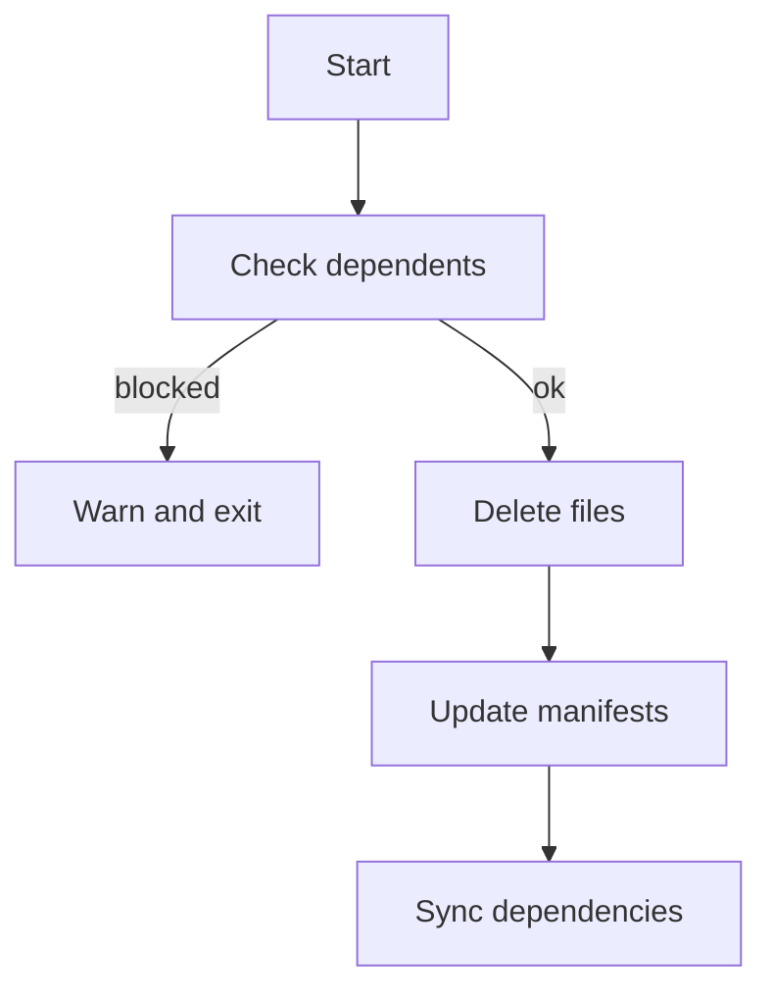

# remove

## Purpose
Remove installed components and clean up manifest entries.

## Syntax

```bash
flutter_shadcn remove <component> [options]
flutter_shadcn remove @<namespace>/<component> [options]
flutter_shadcn remove @<namespace> <component> [more...]
```

## Options

- `--all`: remove all components
- `--force`: remove even if dependents exist

## Alias

- `rm`

## Behavior Details

- Prevents removing components required by others unless `--force`
- Deletes component files
- Updates manifests and dependencies
- `remove icon_fonts` / `remove typography_fonts` first attempt inline rollback for registry-managed asset actions
- `remove --all` also rolls back recorded inline actions for the selected namespace
- Namespace selection can be provided with `--registry-name <namespace>`, `@namespace/component`, or leading `@namespace`

## Flow



## Examples

```bash
flutter_shadcn remove button
flutter_shadcn remove button --force
flutter_shadcn remove typography_fonts
flutter_shadcn remove --all
```

## Common Errors

- Component required by others: use `--force` if safe
