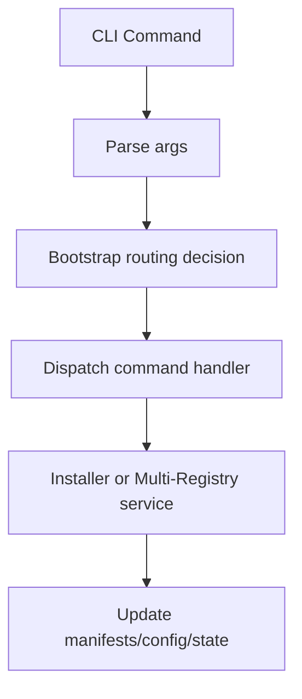

# Architecture

## Modules

- `bin/shadcn.dart`: thin entrypoint (delegates to presentation bootstrap)
- `lib/src/presentation/cli/bootstrap.dart`: runtime wiring + dispatch
- `lib/src/presentation/cli/bootstrap_support.dart`: routing and registry preload helpers
- `lib/src/presentation/cli/commands/*.dart`: command handlers
- `lib/src/installer.dart` + `lib/src/installer_*_part.dart`: install/remove/sync/theme/pubspec/platform responsibilities
- `lib/src/multi_registry_manager.dart` + `lib/src/multi_registry_*_part.dart`: namespace init/add/assets/directory orchestration
- `lib/src/registry.dart`: registry loading and schema validation
- `lib/src/config.dart`: `.shadcn/config.json`
- `lib/src/state.dart`: `.shadcn/state.json`

## High-Level Flow

