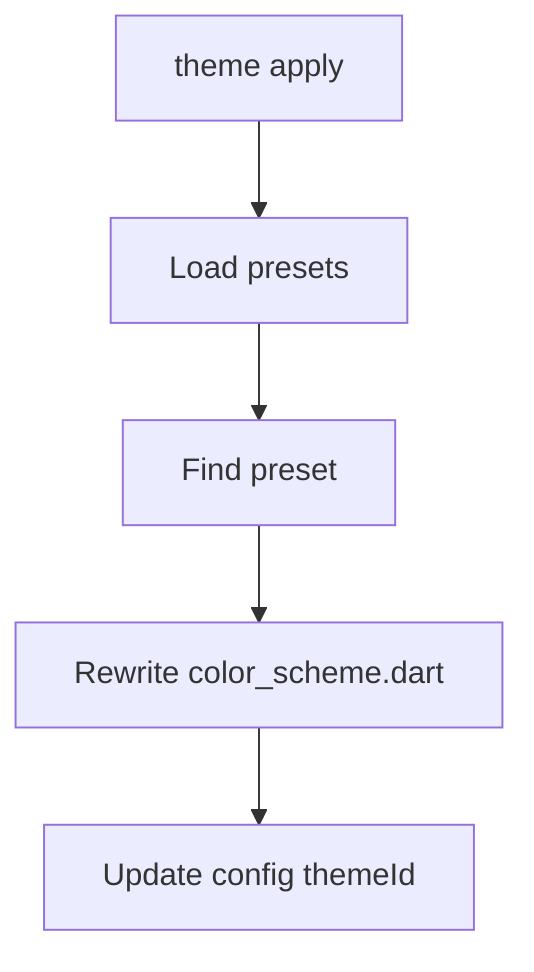

# Theme Application

Theme presets are applied by rewriting `<sharedPath>/theme/color_scheme.dart`.

## Flow

```mermaid
flowchart TD
  A[theme apply] --> B[Load presets]
  B --> C[Find preset]
  C --> D[Rewrite color_scheme.dart]
  D --> E[Update config themeId]
```
